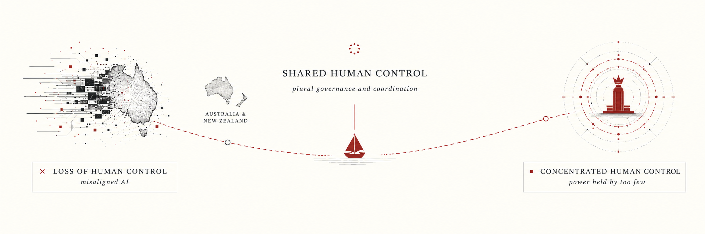

# ANZ 2040: the decisions we still get to make
<!-- Rewritten from the evidence base by Codex, 2026-07-11. Global Plan A probabilities are from AI 2040. The conditional ANZ autocracy estimate is ours. -->

<figure class="hero"></figure>

What can Australia and New Zealand (ANZ) actually decide if AI becomes much more powerful over the next decade?

We start from the excellent [AI 2040](https://ai-2040.com), which describes choices the United States and China could make. We zoom in on what those choices would mean for ANZ, and what we could still do ourselves.

## What ANZ can do

### 1. Prepare before it looks urgent (2026-28)

The later choices need ordinary government machinery: royalty laws, approved sites, a way to pay a dividend, biosecurity capacity, and working relationships with other middle powers. None of this requires believing one precise AI forecast. It is cheap compared with discovering in 2029 that the legal and diplomatic work takes five years.

AI 2040 does not say who should do this work:

> "In case access limitations fail, Plan A involves massive investments into biosecurity and other measures to improve the resilience of the world."
>
> AI Futures Project, [How Plan A solves our 5 biggest problems](https://ai-2040.com/supplements/how-plan-a-solves-our-5-biggest-problems) <!-- local evidence: how-plan-a-solves-our-5-biggest-problems.md:71 -->

ANZ could fund stricter border biosecurity, including capacity for week-long airport quarantine during high-risk periods and privacy-preserving contact tracing.

### 2. Train specialists (2026-29)

ANZ cannot outspend frontier powers on models. It could outspend larger allies in a few overlooked areas that the treaty will need. In its proposed division of technical safety work near the end of the preparation phase, AI 2040 allocates:

> "1% generally study AI personas+propensities and how this is shaped by training"
>
> AI Futures Project, [Alignment roadmap](https://ai-2040.com/supplements/alignment-roadmap) <!-- local evidence: alignment-roadmap.md:218 -->

It also proposes:

> "Automated research assistants and forecasters. AIs could enable a broad range of actors to have access to high-quality, labor intensive research and forecasts. It’s important that these be as truth-seeking as possible, rather than sycophantic."
>
> AI Futures Project, [AI for epistemics](https://ai-2040.com/supplements/ai-for-epistemics) <!-- local evidence: ai-for-epistemics.md:217 -->

AI 2040 does not assign these roles to ANZ. Our candidates are alignment steering, cultural-alignment evaluations, industrial cyber and hacking evaluations, and locked-down border biosecurity. Treaty verification would give some of the same researchers a role in the deal itself.

### 3. Ask for terms before signing (2029)

Australia is named among the countries that join the deal. New Zealand is not mentioned in any of the 18 supplements we checked. AI 2040 recommends warning countries that leaving would bring heavy sanctions, cyberattacks, and perhaps war. <!-- local evidence: verification-plan.md:401; deal-decline.md:783 -->

Scott Alexander describes what observer countries are offered:

> "(at some point the US and China will loop all the other countries into this regulatory regime as some kind of sort-of-but-not-really-voting observers; they agree to follow the rules in exchange for shared benefits, including data centers on their territory, access to the AIs, and a share of future AI-generated wealth. This isn't strictly necessary, because no other country really has the ability to do much with AI, but it's a nice gesture for our utopian scenario)"
>
> Scott Alexander, [Introducing Plan A](https://www.astralcodexten.com/p/introducing-plan-a)

That offer is why accession is our best bargaining moment. Before signing, ask for hosted data centres, a strategic chip reserve, verification seats, equity in AI companies, and durable access rather than a revocable API account.

### 4. Host allied compute (2030-32)

AI 2040 proposes:

> "all of the AI-relevant fabs in the world are moved to destroyable special economic zones [...] located either on the ocean or nearby adversarial superpowers"
>
> AI Futures Project, [Deal decline](https://ai-2040.com/supplements/deal-decline) <!-- local evidence: deal-decline.md:872 -->

The robot economy expands inside these zones until it is as large as today's human economy. Our proposal is that ANZ ask whether it could host one. ([Economics](https://ai-2040.com/supplements/economics-of-plan-a)) <!-- local evidence: economics-of-plan-a.md:439 -->

Data-centre hosting is a separate proposal. Davidson imagines a "chips for frontier access" agreement backed by kill switches:

> "If the US withdraws AI access, allies could destroy US data centres in response. It’s a way to lock in the deal."
>
> Tom Davidson, [How can the middle powers avoid getting trounced?](https://newsletter.forethought.org/p/how-can-the-middle-powers-avoid-getting)

ANZ gets AI access in return for hosting the cluster. If the US ends that access, ANZ can permanently disable the cluster. That makes both sides depend on the deal.

Our smaller proposal is a trusted vault for cold-storage model weights or treaty verification equipment. This would not require hosting the robot economy.

### 5. Keep a public stake in the machine economy (2031-34)

AI 2040 funds its US dividend from AI-hardware and robot permits:

> "In Plan A, most of the US permit revenue share (75% in 2035) is redistributed to the US population as a Citizen’s Dividend"
>
> AI Futures Project, [Economics of Plan A](https://ai-2040.com/supplements/economics-of-plan-a) <!-- local evidence: economics-of-plan-a.md:368 -->

ANZ cannot count on that revenue. Our share would have to come from mineral and energy royalties, public equity held through the Future Fund and NZ Super, and ownership stakes negotiated in return for hosting allied compute. Those rules need to exist before cognitive labour becomes cheap and wage earners lose their bargaining power.

ANZ could route mining royalties and public equity through sovereign wealth funds, then pay part of the returns as a household dividend. Leicht and Ball warn middle powers against selling a domestic bottleneck firm that is:

> "the ticket guaranteeing their home country’s stake in the AI economy"
>
> Leicht and Ball, [The Race Worth Winning](https://www.thefai.org/posts/the-race-worth-winning-middle-powers-in-the-age-of-machine-intelligence) <!-- local evidence: fai-race-worth-winning.md:1747-1762 -->

This supports retaining local ownership of strategic firms. Our separate proposal is to negotiate equity or access when ANZ hosts foreign compute.

AI 2040 also explains why the dividend concerns political power:

> "once AIs can do all the economically relevant tasks, governments and companies lose a strong incentive to provide for their citizens/employees"
>
> AI Futures Project, [How Plan A solves our 5 biggest problems](https://ai-2040.com/supplements/how-plan-a-solves-our-5-biggest-problems) <!-- local evidence: how-plan-a-solves-our-5-biggest-problems.md:63 -->

A statutory dividend gives citizens a legal claim on public investment income that does not depend on their labour remaining economically useful.

### 6. Choose a side if the deal collapses (2030s)

If the US-China AI deal breaks down, ANZ's US security and Chinese trade relationships pull in opposite directions. If the US then denies middle powers access to frontier AI, Davidson's alternative is:

> "The only alternative that makes sense to me is *siding with China.*"
>
> Tom Davidson, [How can the middle powers avoid getting trounced?](https://newsletter.forethought.org/p/how-can-the-middle-powers-avoid-getting)

Joining the US bloc preserves the alliance but puts trade with China at risk. A concert with Japan, Korea, Canada, the Netherlands, and the UK might bargain for access, but only if it was built before the crisis. Leicht and Ball warn that great powers can pick countries off by "offering rewards for defection one by one." ([The Race Worth Winning](https://www.thefai.org/posts/the-race-worth-winning-middle-powers-in-the-age-of-machine-intelligence)) Downloaded Chinese open weights would remain available. Future models, updates, compute, and services could still be withheld.

## Where this could leave us

### I. Doom, about 28%

AI 2040 gives Plan A a 72% chance of alignment, which implies a 28% chance of misaligned takeover. <!-- local evidence: comparing-possible-plans.md:102 -->

Yudkowsky and Soares state the doom case much more strongly than our estimate:

> "If any company or group, anywhere on the planet, builds an artificial superintelligence using anything remotely like current techniques, based on anything remotely like the present understanding of AI, then everyone, everywhere on Earth, will die."
>
> Eliezer Yudkowsky and Nate Soares, [*If Anyone Builds It, Everyone Dies*](https://www.hachettebookgroup.com/titles/eliezer-yudkowsky/if-anyone-builds-it-everyone-dies/9780316595667/)

Once control is lost, ANZ has no policy response left. The preparations above aim to improve the odds before that happens.

### II. Aligned, but not great, about 30%

AI 2040 does not say what makes up this 30%. One possibility is someone else's empire: a government, company, or person holds the decisive systems. ANZ may be materially rich, especially while iron demand is high, but lives under rules set elsewhere.

> "a tiny group of people, or possibly just a single individual, is effectively in control of the world’s only army of superintelligences"
>
> AI Futures Project, [AI 2040](https://ai-2040.com) <!-- local evidence: main.md:61 -->

### III. Dividend commonwealth

We negotiated terms, captured mineral and energy rents, and built the dividend before wages collapsed. Households receive more than the generic payment outside the US and China, but less than citizens of the superpowers.

> "In Plan A, most of the US permit revenue share (75% in 2035) is redistributed to the US population as a Citizen’s Dividend, resulting in roughly $1M/yr per person in 2035 and around $10M/yr in 2040."
>
> AI Futures Project, [Economics of Plan A](https://ai-2040.com/supplements/economics-of-plan-a) <!-- local evidence: economics-of-plan-a.md:368 -->

### IV. Quarry economy

ANZ exports what the robot economy needs but never builds a public stake. Mining profits rise, but households receive no dividend. <!-- local evidence: economics-of-plan-a.md:389 -->

> "As AI devalues human capital relative to physical and intangible assets, capital income consumes a growing proportion of national income. Elevated spending on luxury goods and a productivity-driven investment boom sustains elevated economic growth even as millions face unemployment and diminished purchasing power."
>
> UK Government Office for Science and AI Security Institute, [AI Scenarios 2030](https://www.gov.uk/government/publications/ai-scenarios-2030-helping-policymakers-plan-for-the-future-of-ai/ai-scenarios-2030-helping-policymakers-plan-for-the-future-of-ai) <!-- local evidence: govuk-ai-scenarios-2030.md:655 -->

The resource boom eventually expires or space mining becomes cheaper. A machine economy growing every 6-12 months would bring exhaustion and substitution forward.

### V. Allied compute host

ANZ accepts the data centres and robot zones, but only after securing access and ownership terms. Land, power, and Five Eyes trust become a stake in the machine economy. The price is physical exposure: the hosted clusters are managed as treaty collateral, and the treaty's wars become our own.

> "If the US withdraws AI access, allies could destroy US data centres in response. It’s a way to lock in the deal."
>
> Tom Davidson, [How can the middle powers avoid getting trounced?](https://newsletter.forethought.org/p/how-can-the-middle-powers-avoid-getting)

### VI. Garrison ally

The deal collapses and ANZ chooses the US bloc. We keep the security relationship and lose much of the Chinese market. Australian iron becomes a strategic allocation. This future is poorer and tenser than the dividend or hosting alternatives, but ANZ still has a seat at the table.

> "middle powers should help the US, and make sure they are rewarded with continued access to frontier AI and new technologies (including military tech)"
>
> "The only alternative that makes sense to me is *siding with China.*"
>
> Tom Davidson, [How can the middle powers avoid getting trounced?](https://newsletter.forethought.org/p/how-can-the-middle-powers-avoid-getting) <!-- local evidence: davidson-middle-powers-plan.md:26-28 -->

### VII. Boring decade

AI stalls or governments shut the frontier down. This is outside the Plan A probabilities above.

> "AI progress slows, and AI causes less disruption than expected."
>
> UK Government Office for Science and AI Security Institute, [AI Scenarios 2030](https://www.gov.uk/government/publications/ai-scenarios-2030-helping-policymakers-plan-for-the-future-of-ai/ai-scenarios-2030-helping-policymakers-plan-for-the-future-of-ai) <!-- local evidence: govuk-ai-scenarios-2030.md:186 -->

### VIII. Middle-power concert

The US-China AI deal breaks down, but a coalition formed before the crisis holds together. ANZ pools its supply-chain and hosting leverage with Japan, Korea, Canada, the Netherlands, and the UK. None could demand durable access alone. Together they may get terms and help write the rules.

> "Coordination, done right, reassures partners that they can focus on their comparative advantage instead of pursuing full autarky; and it enables powers to see eye to eye with AI exporters instead of being picked off by great powers offering rewards for defection one by one."
>
> Leicht and Ball, [The Race Worth Winning](https://www.thefai.org/posts/the-race-worth-winning-middle-powers-in-the-age-of-machine-intelligence) <!-- local evidence: fai-race-worth-winning.md:437-449 -->

### IX. ~~Homegrown autocracy~~ free beer and rugby for life

Here AI replaces most cognitive work. The government collects its revenue from AI companies rather than workers removing their leverage, while automated security makes protests and elections easier to ignore. Citizens lose both their income and their leverage over the state.

> "AI could create a similar effect: if governments can generate massive revenue from taxing AI projects rather than citizens, heads of state may lose their economic incentive to ensure citizens prosper. This would weaken citizens’ power to resist coup and backsliding attempts."
>
> "By replacing government employees with loyal AI systems, a head of state could remove important checks on their power."
>
> Davidson, Finnveden, and Hadshar, [AI-Enabled Coups](https://www.forethought.org/research/ai-enabled-coups-how-a-small-group-could-use-ai-to-seize-power) <!-- local evidence: forethought-ai-enabled-coups.md:425-431 -->

To illustrate the outcome, here's what a fictional Australian citizen might have written in 2041:

> Luckily we completely dodged authoritarianism and now Benevolent Prime Minister for Life (BDFL) leads us through. Everyone is very happy, especially since the free beer, rugby, and netball are a great respite from our quickly shrinking population and the ever more confusing global situation. - Joe Citizen, 2041

## Where we depart from AI 2040

We condition on rapid AI progress. The boring decade is visible above, but is outside the Plan A probability denominator.
<!-- Claude: our plateau estimate is about 35%; it is excluded from the conditional Plan A arithmetic. -->

AI 2040 leaves its aligned-but-not-great outcome undecomposed. Someone else's empire is one possibility, not the whole category.

AI 2040's "great future" is global. ANZ could still become autocratic, so we add that risk for the reasons laid out in Forethought's paper, [*AI-Enabled Coups*](https://www.forethought.org/research/ai-enabled-coups-how-a-small-group-could-use-ai-to-seize-power).
<!-- Claude: AI 2040 Plan A great future 0.42 x our conditional ANZ autocracy estimate 0.30 = 0.126 absolute; 0.42 x 0.70 = 0.294 remains plural. -->

AI 2040 models energy use and mineral reserves, but not the tonnage required by a rapidly growing robot economy. We add ANZ's mineral exposure, public ownership, and hosting terms. ([Economics of Plan A](https://ai-2040.com/supplements/economics-of-plan-a))

## Sources and thanks

This is built from the AI Futures Project's [AI 2040](https://ai-2040.com) scenario and supplements. Their caveat applies to our use of the numbers too: the economic model "plausibly contains bugs" and they do not trust its outputs to be accurate. The local source mirrors retain exact line references for auditing.

Thanks also to Rebecca Hawkins, Michael J. Kerrison, Tom Barber, and others in the AI 2027 group who joined a June 2026 scoping discussion.

The middle-power framing also draws on [AI 2027](https://ai-2027.com), [Europe 2031](https://europe2031.ai), Tom Davidson's [middle-power plan](https://newsletter.forethought.org/p/how-can-the-middle-powers-avoid-getting), Leicht and Ball's [The Race Worth Winning](https://www.thefai.org/posts/the-race-worth-winning-middle-powers-in-the-age-of-machine-intelligence), and Scott Alexander's [Introducing Plan A](https://www.astralcodexten.com/p/introducing-plan-a). Australian groundwork came from the [e61 Institute](https://e61.in), [Tech Policy Design Institute](https://techpolicy.au/aiagency), [ASPI](https://www.aspistrategist.org.au/data-centres-are-australias-chance-to-shape-ais-future/), and [Kate Chaney MP](https://www.katechaney.com.au/making_technology_safe).
