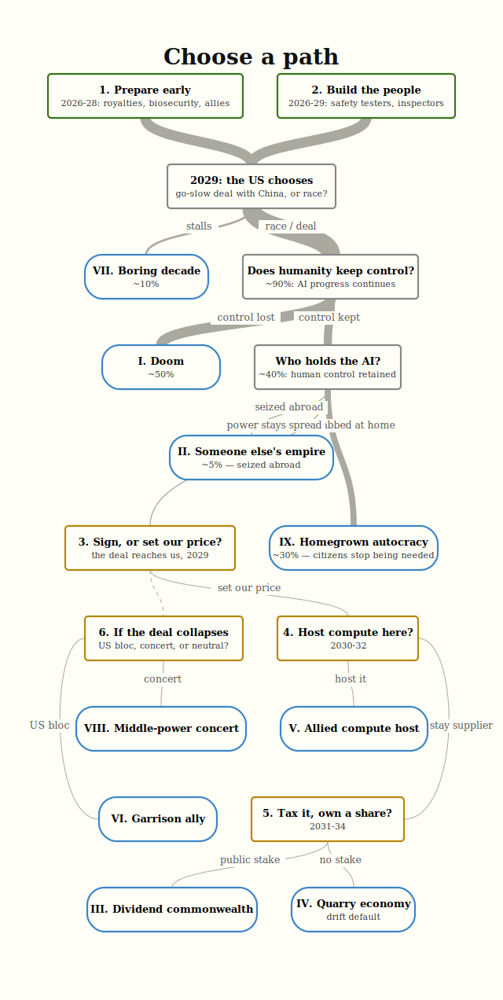

# ANZ 2040: the decisions we still get to make
<!-- Rewritten from the evidence base by Codex, 2026-07-11. Probabilities are ours, conditional on rapid AI progress making the 2029 decision matter. -->

What can Australia and New Zealand actually decide if AI becomes much more powerful over the next decade?

We start from the excellent [AI 2040](https://ai-2040.com), which describes choices the United States and China could make. We zoom in on what those choices would mean for Australia and New Zealand, and what we could still do ourselves.

The probabilities below assume rapid AI progress. We leave aside the roughly 35% chance that progress plateaus first.

We don't get to choose whether the United States and China race, slow down, or make a deal. We don't get to choose whether a powerful AI remains under human control. But we do get a few choices about our position before those larger decisions are made. Some are cheap and useful across almost every future. The valuable later choices only exist if we prepare for them now.

## What Australia and New Zealand can do*

### 1. Prepare before it looks urgent (2026-28)

The later choices need ordinary government machinery: royalty laws, approved land, a way to pay a dividend, biosecurity capacity, and working relationships with other middle powers. None of this requires believing one precise AI forecast. It is cheap compared with discovering in 2029 that the legal and diplomatic work takes five years.

Biosecurity is the clearest case. AI 2040 proposes "massive investments into biosecurity and other measures to improve the resilience of the world," but does not assign the work to anyone. New Zealand already runs a serious agricultural biosecurity system. This is a useful thing for it to get unusually good at. <!-- local evidence: how-plan-a-solves-our-5-biggest-problems.md:69; faq.md:94 -->

### 2. Train the people the treaty needs (2026-29)

Australia and New Zealand can contribute people even when they cannot contribute frontier models. AI 2040 allocates only 1% of its safety budget to studying model character, meaning persistent behavioural tendencies or "personas+propensities." It says almost nothing about activation steering, which changes behaviour by intervening on a model's internal activity, or assistance games, which train an AI to infer what a person wants through cooperation. It does call truth-seeking AI and public forecasting a priority. Australia and New Zealand could specialise in those areas, as well as evaluations, treaty verification, biosecurity, and cyber work through the Five Eyes intelligence alliance. ([Alignment roadmap](https://ai-2040.com/supplements/alignment-roadmap), [AI for epistemics](https://ai-2040.com/supplements/ai-for-epistemics)) <!-- local evidence: alignment-roadmap.md:216; ai-for-epistemics.md:41 -->

### 3. Ask for terms before signing (2029)

Australia is named among the countries that join the deal. New Zealand is not mentioned in any of the 18 supplements we checked. Once inside, leaving could mean sanctions, cyberattack, or war. The realistic decision is therefore what to ask for before signing: hosted data centres, a strategic chip reserve, verification seats, equity in AI companies, and durable access rather than a revocable API account. <!-- local evidence: verification-plan.md:401; deal-decline.md:783 -->

Scott Alexander's summary is unusually blunt. Observer countries follow the rules in return for data centres, AI access, and a share of future wealth, even though the great powers don't strictly need to offer it. That makes accession our best bargaining moment. Signing the standard form gives it away. ([Introducing Plan A](https://www.astralcodexten.com/p/introducing-plan-a))

### 4. Host allied compute (2030-32)

AI 2040 moves advanced chip fabs and robot production into special economic zones that can be destroyed if the deal breaks. The zones are meant to sit near an ocean or an adversarial power, and the robot economy expands inside them until it is as large as today's human economy. North-west Australia fits those criteria and sits above much of the ore the machines would consume. ([Deal decline](https://ai-2040.com/supplements/deal-decline), [economics](https://ai-2040.com/supplements/economics-of-plan-a)) <!-- local evidence: deal-decline.md:872; economics-of-plan-a.md:439 -->

Hosting creates exposure as well as income. The same cluster can be a target, collateral for the treaty, and leverage against being cut off. Tom Davidson makes the mechanism explicit: if the US withdraws AI access, allies could destroy US data centres on their territory. A kill switch negotiated at accession is leverage. A foreign cluster accepted without access rights is just exposure. ([Davidson 2026](https://newsletter.forethought.org/p/how-can-the-middle-powers-avoid-getting))

There is also a smaller trusted-vault option. Australia could host cold-storage model weights, treaty verification equipment, or monitoring linked to Pine Gap without hosting the whole robot economy. Geologically stable ground and Five Eyes trust make this the lowest-volume version of the policy.

### 5. Keep a public stake in the machine economy (2031-34)

The US dividend in AI 2040 comes from compute permits. By 2035, the scenario sends 75% of the US permit share to US citizens. Australia and New Zealand cannot rely on that. Our dividend would need resource royalties, land taxes, and public equity held through the Future Fund and NZ Super. Those rules need to exist before cognitive labour becomes cheap and wage earners lose their bargaining power. ([Economics of Plan A](https://ai-2040.com/supplements/economics-of-plan-a)) <!-- local evidence: economics-of-plan-a.md:368 -->then

Who owns the rents matters more than the size of the boom. The same ore and land can support a public dividend or a few mining dynasties. Leicht and Ball warn that selling a strategic firm can look like an unexpected windfall while giving up the country's "ticket guaranteeing their home country's stake in the AI economy." In a rapid takeoff, taking only cash is especially bad: the useful payment is equity, access, or ownership of productive assets. ([The Race Worth Winning](https://www.thefai.org/posts/the-race-worth-winning-middle-powers-in-the-age-of-machine-intelligence)) <!-- local evidence: fai-race-worth-winning.md:1747-1762 -->

Australia probably starts above the generic non-US country. Compulsory superannuation gives many households an existing claim on global capital, while mining gives governments a claim on inputs the robot economy needs. Neither is evenly shared by default. Superannuation gains follow existing balances and investment choices. Mining income reaches households only when royalties, taxes, public ownership, or transfers capture it. That is what separates the Dividend commonwealth from the Quarry economy. <!-- local evidence: fai-race-worth-winning.md:1925-1939 -->

The political claim is stronger, and more speculative. If governments no longer depend on wages or citizen labour, owners and automated security may stop needing broad consent. A legally entrenched citizen claim on public assets keeps ordinary people tied to the revenue stream and gives them something material to defend through democratic institutions. We are treating distribution as a constraint on domestic power, not merely as welfare.

### 6. Choose a side if the deal collapses (2030s)

If the US-China deal declines, Australia's security guarantor and largest customer pull in opposite directions. Joining the US bloc keeps the alliance and loses trade. A concert with Japan, Korea, Canada, the Netherlands, and the UK might bargain for access, but only if it was built before the crisis. Leicht and Ball's warning is that a coalition improvised late will be picked off "one by one." Trying to hedge returns us to someone else's empire by a slower route. Free Chinese open-weight models don't remove the dependency; a supplier earning nothing from us also loses nothing by cutting us off. ([The Race Worth Winning](https://www.thefai.org/posts/the-race-worth-winning-middle-powers-in-the-age-of-machine-intelligence), [Davidson 2026](https://newsletter.forethought.org/p/how-can-the-middle-powers-avoid-getting))

## Where this could leave us*

Doom and concentrated global power account for most of our probability. Australia and New Zealand only get the later choices if humanity keeps control and no single actor takes it all.

### I. Doom, about 50%

AI 2040's own comparison gives Plan A a 42% chance of a "great future," falling to 10-25% for its alternatives. Combining the table's conditional rows implies misaligned takeover at roughly one quarter under Plan A and roughly three quarters in the modal race. Our 50% is a rough mixture across those possibilities. <!-- local evidence: comparing-possible-plans.md:104 -->

Yudkowsky and Soares state the doom case much more strongly than our estimate:

> "If any company or group, anywhere on the planet, builds an artificial superintelligence using anything remotely like current techniques, based on anything remotely like the present understanding of AI, then everyone, everywhere on Earth, will die."
>
> Eliezer Yudkowsky and Nate Soares, [*If Anyone Builds It, Everyone Dies*](https://www.hachettebookgroup.com/titles/eliezer-yudkowsky/if-anyone-builds-it-everyone-dies/9780316595667/)

Once control is lost, Australia has no policy response left. The preparations above aim to improve the odds before that happens.

### II. Someone else's empire, about 25%

The AI remains aligned, but control of that AI does not spread. A government, company, or person holds the decisive systems. Australia and New Zealand may be materially rich, especially while iron demand is high, but they live under rules set elsewhere.

> "a tiny group of people, or possibly just a single individual, is effectively in control of the world’s only army of superintelligences"
>
> AI Futures Project, [AI 2040](https://ai-2040.com) <!-- local evidence: main.md:61 -->

### III. Dividend commonwealth

We negotiated terms, captured resource and land rents, and built the dividend before wages collapsed. Households share in the through a payment that is better than other countries but worse the the superpowers.

> "In Plan A, most of the US permit revenue share (75% in 2035) is redistributed to the US population as a Citizen’s Dividend, resulting in roughly $1M/yr per person in 2035 and around $10M/yr in 2040."
>
> AI Futures Project, [Economics of Plan A](https://ai-2040.com/supplements/economics-of-plan-a) <!-- local evidence: economics-of-plan-a.md:368 -->

### IV. Quarry economy

This is the drift outcome. The country exports what the robot economy needs, but captures none of the upside. <!-- local evidence: economics-of-plan-a.md:389 -->

> "As AI devalues human capital relative to physical and intangible assets, capital income consumes a growing proportion of national income. Elevated spending on luxury goods and a productivity-driven investment boom sustains elevated economic growth even as millions face unemployment and diminished purchasing power."
>
> UK Government Office for Science and AI Security Institute, [AI Scenarios 2030](https://www.gov.uk/government/publications/ai-scenarios-2030-helping-policymakers-plan-for-the-future-of-ai/ai-scenarios-2030-helping-policymakers-plan-for-the-future-of-ai) <!-- local evidence: govuk-ai-scenarios-2030.md:655 -->

The resource boom eventually expires or space mining becomes cheaper. A machine economy growing every 6-12 months would bring exhaustion and substitution forward.

### V. Allied compute host

Australia accepts the data centres and robot zones, but only after securing access and ownership terms. Land, power, and Five Eyes trust become a stake in the machine economy. The price is physical exposure: the hosted clusters are managed as treaty collateral, and the treaty's wars become our own.

> "If the US withdraws AI access, allies could destroy US data centres in response. It's a way to lock in the deal."
>
> Tom Davidson, [How can the middle powers avoid getting trounced?](https://newsletter.forethought.org/p/how-can-the-middle-powers-avoid-getting)

### VI. Garrison ally

The deal collapses and Australia chooses the US bloc. We keep the security relationship and lose much of the Chinese market. Iron becomes a strategic allocation. This future is poorer and tenser than the dividend or hosting alternatives, but Australia still has a seat at the table.

> "middle powers should help the US, and make sure they are rewarded with continued access to frontier AI and new technologies (including military tech)"
>
> "The only alternative that makes sense to me is siding with China."
>
> Tom Davidson, [How can the middle powers avoid getting trounced?](https://newsletter.forethought.org/p/how-can-the-middle-powers-avoid-getting) <!-- local evidence: davidson-middle-powers-plan.md:26-28 -->

### VII. Boring decade, about 10%

AI stalls or governments shut the frontier down. 

> "AI progress slows, and AI causes less disruption than expected."
>
> UK Government Office for Science and AI Security Institute, [AI Scenarios 2030](https://www.gov.uk/government/publications/ai-scenarios-2030-helping-policymakers-plan-for-the-future-of-ai/ai-scenarios-2030-helping-policymakers-plan-for-the-future-of-ai) <!-- local evidence: govuk-ai-scenarios-2030.md:186 -->

### VIII. Middle-power concert

The deal declines, but a coalition formed before the crisis holds together. Australia and New Zealand pool their supply-chain and hosting leverage with Japan, Korea, Canada, the Netherlands, and the UK. None could demand durable access alone. Together they may get terms and help write the rules.

> "Coordination, done right, reassures partners that they can focus on their comparative advantage instead of pursuing full autarky; and it enables powers to see eye to eye with AI exporters instead of being picked off by great powers offering rewards for defection one by one."
>
> Leicht and Ball, [The Race Worth Winning](https://www.thefai.org/posts/the-race-worth-winning-middle-powers-in-the-age-of-machine-intelligence) <!-- local evidence: fai-race-worth-winning.md:437-449 -->

### IX. ~~Homegrown autocracy~~ free beer and rugby for life

This is the domestic version of the global power-grab risk. Cognitive wages collapse, public ownership never develops, and automated security removes the state's remaining practical dependence on citizens. No coup is required. Political leverage drains away with economic leverage.

> "AI could create a similar effect: if governments can generate massive revenue from taxing AI projects rather than citizens, heads of state may lose their economic incentive to ensure citizens prosper. This would weaken citizens’ power to resist coup and backsliding attempts."
>
> "By replacing government employees with loyal AI systems, a head of state could remove important checks on their power."
>
> Davidson, Finnveden, and Hadshar, [AI-Enabled Coups](https://www.forethought.org/research/ai-enabled-coups-how-a-small-group-could-use-ai-to-seize-power) <!-- local evidence: forethought-ai-enabled-coups.md:425-431 -->

To illustrate the risk, here's what a fictional Australian citizen might have written in 2041:

> Luckily we completely dodged a coup and now have Benevolent Dictator for Life (BDFL) Gina Palmer to lead us through. Everyone is very happy, especially since the free beer, rugby, and netball are a great respite from our quickly shrinking population and ever more confusing global situation. - Joe Citizen, 2041

## Where we depart from AI 2040

AI 2040 models energy consumption rising about eight times by 2040 and notes that proven mineral reserves cover decades of current extraction, but it does not price the tonnage needed for a robot economy growing every 6-12 months. Coal, uranium, energy trade, and Australian mine capacity are outside its model. ([Economics of Plan A](https://ai-2040.com/supplements/economics-of-plan-a))

We use its land estimates with the authors' warning that this is a "very rough model" they do not necessarily endorse. We also give model character and activation steering more weight than their roadmap does.

AI 2040 does share some US wealth abroad, but very unevenly. In 2032 its American dividend starts at $45,000 while adults outside the US and China average $1,200. By 2035 the figures are about $1M and $10,000. Australia may do better than that generic non-US payment through superannuation and mining, but only if the gains are broadly owned. A rich national balance sheet can still leave the median household without economic leverage. ([AI 2040](https://ai-2040.com/?choices=plan-a-root)) <!-- local evidence: main.md:553-557 -->

We leave out a trans-Tasman split and a separate Australian decision during US sabotage operations because neither changes the main choices above.

## Sources and thanks

This is built from the AI Futures Project's [AI 2040](https://ai-2040.com) scenario and supplements. Their caveat applies to our use of the numbers too: the economic model "plausibly contains bugs" and they do not trust its outputs to be accurate. The local source mirrors retain exact line references for auditing.

Thanks also to the authors of related scenarios and the Australian policy people who joined a June 2026 scoping discussion.

<small>* The Australian and New Zealand decisions and futures are extrapolations from the cited work. A citation means we used that source, not that its authors endorse this scenario.</small>

The middle-power framing also draws on [AI 2027](https://ai-2027.com), [Europe 2031](https://europe2031.ai), Tom Davidson's [middle-power plan](https://newsletter.forethought.org/p/how-can-the-middle-powers-avoid-getting), Leicht and Ball's [The Race Worth Winning](https://www.thefai.org/posts/the-race-worth-winning-middle-powers-in-the-age-of-machine-intelligence), and Scott Alexander's [Introducing Plan A](https://www.astralcodexten.com/p/introducing-plan-a). Australian groundwork came from the [e61 Institute](https://e61.in), [Tech Policy Design Institute](https://techpolicy.au/aiagency), [ASPI](https://www.aspistrategist.org.au/data-centres-are-australias-chance-to-shape-ais-future/), and [Kate Chaney MP](https://www.katechaney.com.au/making_technology_safe).
